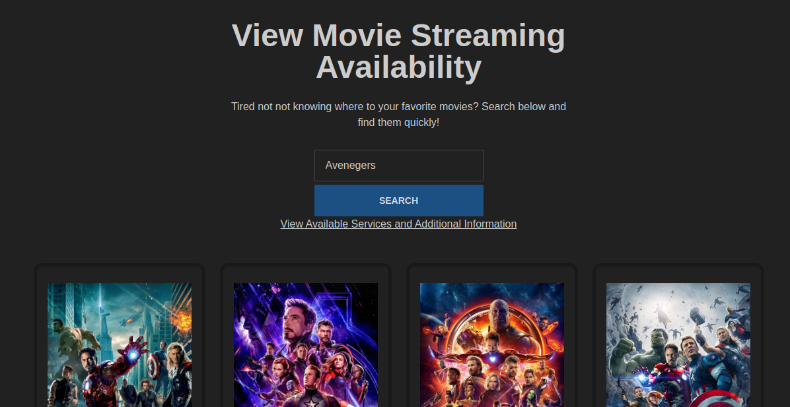

Movie Finder allows a user to search for movies among the many popular streaming services and lists various information about that movie. Uses the Streaming Availability API: https://rapidapi.com/movie-of-the-night-movie-of-the-night-default/api/streaming-availability/

